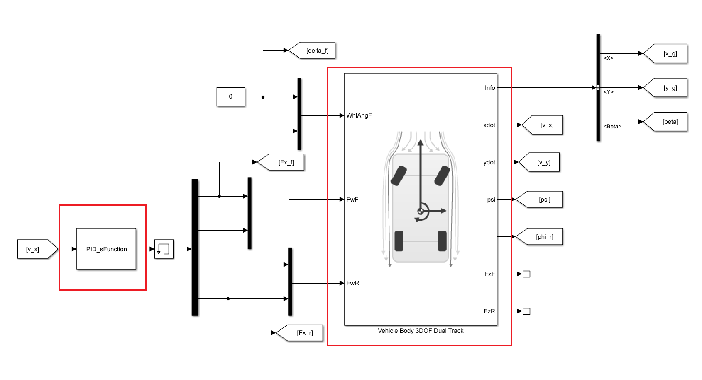
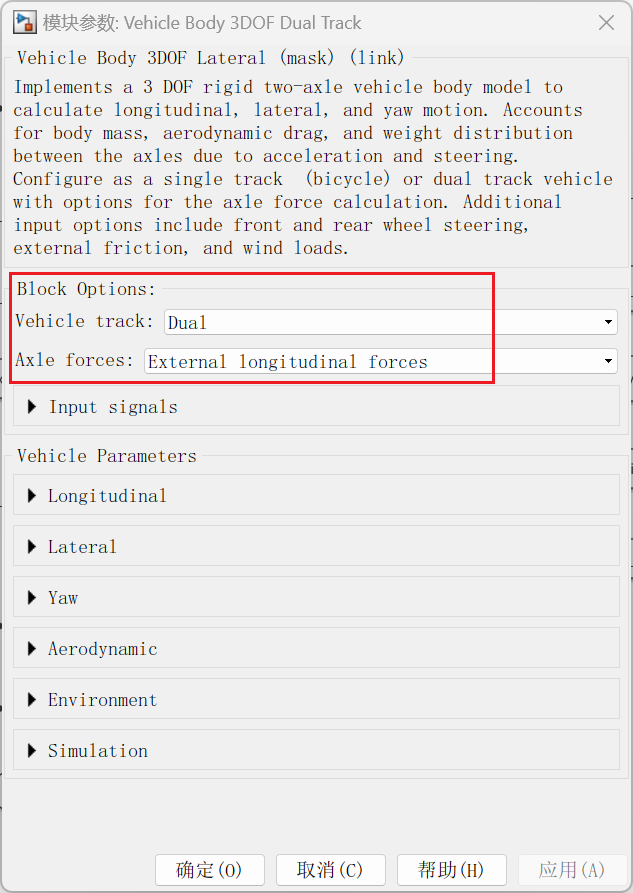
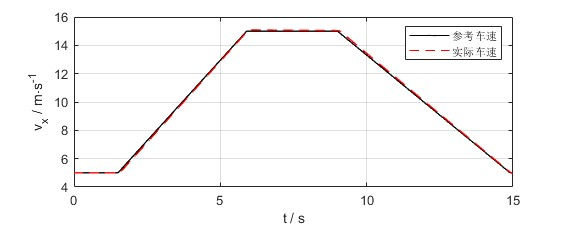
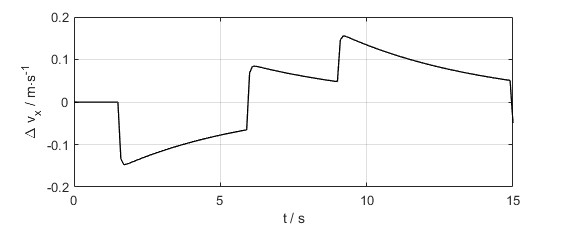
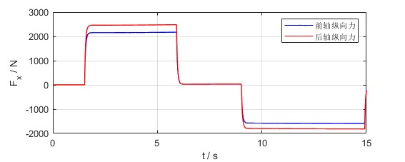
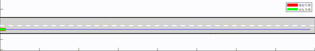

# 1 纵向控制任务与控制算法介绍

- 纵向控制说明
    车辆轨迹纵向控制希望控制的是纵向的位置，但实际控制过程中横总向的位置误差通常耦合在一起，单独控制纵向位置的意义不大，因此自动驾驶车辆的纵向控制任务主要指对纵向车速的控制。
- PID控制算法
    比例积分微分控制（proportional-integral-derivative control），简称PID控制。PID控制简单实用，应用广泛，目前大部分在车上应用的控制算法中都是PID控制。PID控制参数数量少，在对模型了解不多的情况下，通过人工反复调试参数也能得到理想的控制效果。

# 2 本地运行

## 2.1 软件准备

本项目可运行在MATLAB R2022a及以上版本，需安装完整的Simulink工具箱。

## 2.2 文件说明

- `reference.mat`为参考轨迹数据，包含时间戳`t_ref`,x坐标`x_ref`,y坐标`y_ref`三个变量。参考轨迹通常由上游决策规划模块生成。

- `Sim_Demo.slx`为Simulink文件，用于图形化编程及仿真运行。主要包括整体控制框架和被控对象模型等。

- `PID_sFunction.m`控制器s函数文件，PID控制算法代码编写在该文件中。

- `evaluator.mlx`后处理部分代码在该文件中，包括轨迹、误差、车辆状态参数曲线的绘制，动画演示。
  
  ## 2.3 操作步骤
  
  ### 2.3.1 准备

- 下载项目并解压，将MATLAB的工作路径设置为该文件夹；
    

- 或将文件夹中的文件复制到当前文件夹下。
  
  ### 2.3.2 运行文件

- 双击`Sim_Demo.slx`文件，并等待启动Simulink。

- 点击`运行`按钮开始仿真。
    

- 运行结束后，后在工作目录下会生成`reference_processed.mat`和 `Sim_result.mat`两个数据文件。`reference_processed.mat`为仿真时控制器为减少重复计算，初始化计算产生的中间数据。`Sim_result.mat`为仿真结果数据。
  
  ### 2.3.3 后处理运行结果

- 仿真结束后，需要对结果进行可视化绘图。双击 `evaluator.mlx`。

- 在`实时编辑器`选项卡下，按顺序点击`运行节`，查看每一节的运行结果。
    

# 3 代码解析与说明

## 3.1 仿真模型说明

如图，仿真模型分成控制器和被控对象两部分。控制器由s-函数编写而成，被控车辆是MATLAB提供的三自由度车辆模型，模型框图如下


被控是三自由度车辆设置参数为纵向力输入

纵向控制时不考虑横向，即车辆跟踪直线，车辆的前轮转角始终为0

## 3.2 控制算法说明

### 3.2.1 PID算法

PID控制算法原理就是对误差的反馈。误差及其积分和微分的运算作为输入给到被控系统，系统只要还有误差，则PID控制器就能计算输入来纠正误差，最终让误差消失，实现控制目目标。

为统一格式，PID控制算法也用s-函数进行编写，其主函数为

```matlab
function [sys,x0,str,ts]=PID_sFunction(t,x,u,flag)

switch flag
    case 0
        [sys,x0,str,ts]=mdlInitializeSizes;
    case 2
        sys=mdlUpdate(t,x,u);
    case 3
        sys=mdlOutputs(t,x,u);
    case {1, 4, 9}
        sys = [];
    otherwise
        error(['Unhandled flag = ',num2str(flag)]);
end

end
```

在本案例中定义速度误差为

$$
v_{err}=v_{r}-v
$$

其中，$v_r$为期望的车速，期望车速在初始函数中进行计算

```matlab
function [sys,x0,str,ts]=mdlInitializeSizes

sizes = simsizes;
sizes.NumContStates = 0;
sizes.NumDiscStates = 3;
sizes.NumOutputs = 4;
sizes.NumInputs = 1;
sizes.DirFeedthrough = 1;
sizes.NumSampleTimes = 1;
sys=simsizes(sizes);

x0=[0,0,0]';
str=[];
ts=[0.01 0]; % 采样时间 偏移量

% 初始处理化处理计算整条轨迹的车速
load("reference.mat")
% 算参考车速
v_ref=zeros(size(t_ref));
for i=1:length(x_ref)-1
    Delta_dis(i) = norm([x_ref(i+1)-x_ref(i),y_ref(i+1)-y_ref(i)]);
end

v_ref(1:end-1) = Delta_dis./diff(t_ref);
v_ref(end)=v_ref(end-1);
save("reference_processed.mat",'t_ref','x_ref',"y_ref","v_ref");

end
```

则将误差的比例，积分、微分加权后得到希望的输入加速度

$$
a_x=
k_p\cdot v_{err}
+k_i\cdot \int {v_{err} dt} 
+k_d\cdot \frac{dv_{err}}{dt}
$$

其中，$k_p,k_i,k_d$分别为比例、积分、微分系数
在s-函数中，可以用离散状态计算上述积分和微分过程

$$
a_x(k)=
k_p\cdot v_{err}(k)
+k_i\cdot S_{err}(k)
+k_d\cdot \frac{v_{err}(k)-v_{err}(k-1)}{T_s}
$$

其中,$T_s$为采样时间，积分用累加表示如下

$$
S_{err}(k)=S_{err}(k-1)+v_{err}(k)\cdot T_s
$$

因为计算积分和微分需要用到上一时刻的变量，因此可以用到s-函数的`mdlUpdate`模块

```matlab
function sys=mdlUpdate(t,x,u)

ts=0.01;
load("reference_processed.mat")
v_ref1=interp1(t_ref,v_ref,t);

sys(2)=x(1); % v_err_k-1 上一时刻车速差
sys(1)=v_ref1-u(1); % v_err_k 本时刻车速差
sys(3)=x(3)+ts*x(1);% v_err_int 车速误差积分

end
```

### 3.2.2纵向力分配

PID控制器得到的是纵向加速度，也可以认为是油门开度，或总的纵向力，对不同的被控车辆输入的信号需求可以是不同。对于本案例的被控对象，要求输入的是施加在四个车轮上的纵向力，为充分发挥路面的附着条件，对四个车轮上的纵向力按照垂向载荷进行简单分配。

总的纵向力为

$$
F_x=ma_x
$$

简单起见，可以根据静态载荷进行分配
因此前后轴的垂向力为

$$
\begin{matrix}
F_{zf}=\frac{mgb}{a+b}\\
F_{zr}=\frac{mga}{a+b}\\
\end{matrix}
$$

前后轴的纵向力为

$$
\begin{matrix}
F_{xf}=\frac{F_{zf}}{mg} F_x\\
F_{xr}=\frac{F_{zr}}{mg} F_x\\
\end{matrix}
$$

将上述过程放在s函数的输出函数中得到

```matlab
function sys=mdlOutputs(t,x,u)

ts=0.01;
kp=15;
ki=3;
kd=0.1;

ax=kp*x(1)+ki*x(3)+kd*(x(1)-x(2))/ts;

m=2000;
a=1.4;
b=1.6;
L=a+b;
g=9.8;

Fz_f=m*g*b/L;
Fz_r=m*g*a/L;
Fx=m*ax;
% 按照垂向载荷分配纵向力
Fx_f = Fx*Fz_r/(m*g);
Fx_r = Fx*Fz_f/(m*g);

sys(1)=0.5.*Fx_f;
sys(2)=0.5.*Fx_f;
sys(3)=0.5.*Fx_r;
sys(4)=0.5.*Fx_r;

end
```

## 3.3结果评价与可视化

### 3.3.1 指标定义

纵向跟踪任务指标通常简化为速度跟踪，因此指标为纵向车速跟踪控制的误差，纵向平均车速控制误差可以定义为

$$
\bar{v}_{err}=\frac{1}{N}\sum_{k=1}^N\left|v(k)-v_r(k)\right|
$$

本案例中，纵向速度平均控制误差为$\bar{v}_{err}=0.0808 \mathrm{m/s}$

### 3.3.2 结果曲线

- 纵向速度跟踪曲线和误差曲线如下图
    
    

- 纵向力的输入曲线如下图
    

- 效果动画
    